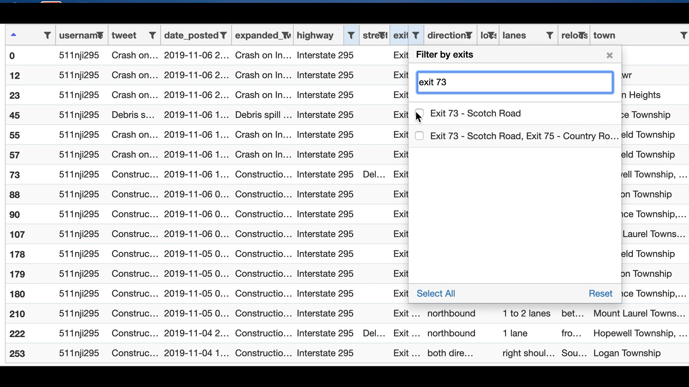

# Mapping Real-Time Disaster Routes for Emergency Response

----

## Table of Contents

 - [Team](#Team)
 - [Problem Statement](#Problem-Statement)
 - [Resources Used](#Resources-Used)
 - [Executive Summary](#Executive-Summary)
 - [Demonstration](#Demonstration)
 - [Conclusion + Next Steps](#Conclusion-+-Next-Steps)

 
----

## Team

- [Nick Cote](https://www.linkedin.com/in/nicholas-cote1/)
- [Fausto De La Rosa Mañón](https://www.linkedin.com/in/faustodelarosamanon/)
- [Ilya Kvyatkovskiy](https://www.linkedin.com/in/ikviatkovski/)

----

## Problem Statement
Imagine yourself as a member of FEMA's emergency response team.  An emergency situation has arisen and you are assigned to the location of said emergency.  You get into your vehicle, add the address to a GPS system and drive off.  In the middle of your route, you encounter a closed road - something that was not accounted for by the GPS.  This now costs you significant time in backtracking and figuring out a better route to navigate.  This time costs could be detrimental in an emergency situation, coming in at a high cost.  What if we could prevent such a hinderance?  Could we use social media in order to provide real-time information on planned routes?  If so, how do we go about it?  

Our goal is to be able to extract granular detail on road closures and successfully map such closures in order to expedite routes and properly allocate resources to high closure areas.  We will seek to extract twitter data on road closures, build a classification model to determine if the tweet is relevant to a road closure, extract location data from these "closure" tweets, and construct a map to plot these closures as they occur.

----

## Resources Used
- Twitter
- Key Python Libraries:
    - GetOldTweets3
    - spaCy
    - geocoder
    - Folium

----

## Executive Summary
In order to begin our process of building out our tool, we first had to decide where to look.  We settled on Jersey City, NJ as our model city to build around.  Once that was decided, we broke down our process into the following steps:

***Data Acquisition***
We pulled all official New Jersey 511 Twitter accounts, as well as any partner accounts listed on their website.  Afterwards, we needed to use the official Twitter accounts in order to scrape the necessary tweets for information.  Using the GetOldTweets3 library, we were able to build large enough training (over 20,000 tweets total) datasets to work with.  We also pulled an additional 8,000 tweets seperately to use as our testing dataset.  We decided to forgo news articles as a source, due to several API restrictions (i.e. 15 minute delay, which is critical during an emergency and a 500 request daily limit) as well the fact that Twitter is quicker to receive data from in real-time as well as being concise (280 character max).

***Data Cleaning***
We pulled in the twitter data that was scraped and cleaned it in a couple of ways.  The simplest were dropping unnecessary columns as well as converting the `date_posted` column into an actual `datetime` data type.  Next we removed legacy HTML characters as well as an links, as tweets tend to have.  We finished our cleaning process by removing the `#` character, so we can just have the actual topic that the `#` was referencing. 

***Preprocessing and Modeling***
After cleaning the data, we addressed the issue of potential class imbalance by construcing our dataset in a specific way.  We attempted to use and fit several classifiers including logistical regression, decision tree, bagging, random forest,extra trees, and multinomial naive bayes.  We complemented these classifiers with some necessary hyperparameters in order to select the best classifier, based on accuracy.

***Location Extraction Using spaCy***
After classifying tweets as "closure tweets" in our modeling step, We used spaCy to extract locations from our closure tweets.  spaCy is a powerful Natural Language Processing tool that is most commonly used to recognize textual patterns.  We worked with its Named Entity Recognition feature that applies labels to a given word/words.  For instance, the base spaCy library can identity certain words as being a Geopolitical Entity or a Business.  However, we created a custom spaCy library that contained labels for location data such as town, highway, street, exit, and lane in question (among other items).  This allowed us to capture granular and specific detail on the road closures to provide as wholistic a picture of the closure as possible.

***Coordinate Acquisition***
Once we have separated key words such as streets, highways and towns, our next step was to acquire the coordinates of locations that each tweet was referencing.  For this, we leveraged multiple libraries, but ultimately settled upon the `geocoder` library.  We created an additional column within the dataframe where each value in the column is passed through into the geocoder library in order to extract its respective latitude and longitude coordinates.  We feed the resulting dataframe into a csv file for the next step.

***Mapping***
In this final step, we leverage the folium library in python in order to properly plot the referenced locations in the tweets on a map.  We aggregate multiple plot points into a cluster, as well as created a legend whereby users of the map can filter out point by twitter user accounts.  When an individual zooms in and opens up to a specific point, a popup appears that gives the twitter account associated with that point on the map, as well as the details of the tweet and the date and time of when the point was posted.

----

## Demonstration
Below is a snapshot of the tabular data that we were able to compile as a result of our process.  A video of the table in action can be found in this [link](https://www.dropbox.com/sh/ylmct6fvdwr8kt7/AAAh4RicEoVeO_N4JP1CBo91a?dl=0). This video demonstrates how a user can take our modeling and location extraction to search and sort through road closures by date, city, street/highway, and even which lanes are closed.  This can be used for both real time checks and historical data on common types of road closures that can be used for resource allocation planning. 

Below is a snapshot of an interactive html map that plots the road closures where they occur.  A video of the map in action can be found in this [link](https://www.dropbox.com/sh/ylmct6fvdwr8kt7/AAAh4RicEoVeO_N4JP1CBo91a?dl=0).  This video demonstrates how a user can zoom in to a specific location, while keeping track of the amount of twitter posts made, via the clusters.  Once we breakdown each cluster, we can identify individual posts made for that area.  In clicking through we can see what user made the twitter post, the details of that post, as well as when the post was made, in order to account for most recent activity / updates.  The map can also filter out specific users, as to reduce the amount of 'noise' for the user. The interactive map is an html file that can run locally in the users's browser.  The file can be found in the `maps` folder.

----

## Conclusion + Next Steps

Addressing our Problem Statement, we have successfully built a Minimum Viable Product that captures granular closure data and maps this data in a fashion that will help stakeholders and users properly plan for evacuations and can also provide historical insight into road closures in a way that can help community organizations (such as local governments) allocate resources to address issues with specific roads.  Via our Twitter webscraping, we can successfully uncover tweets from any user going back from a given date range.  Moreover, our Baggiging Classifer model can identify (with strong confidence) whether a tweet is related to a road closure.  Our work with spaCy has given us the means to extract details on locations all the way down to which lane was closed on a road.  And finally, our Folium mapping allows users to trace back tweets on closures and visualize the locations of these tweets. Per our demonstration above, we have built MVP's of two products that can assist users: sortable, tabular data on road closures and a map of these closures. 

We do make note of additional steps to take to improve our product.  Firstly, we can continue to train our spaCy library in order to obtain more and more accurate location information and to add new details such as capturing if a stretch of road was closed.  Additionally, we can work with local experts to better identify local naming conventions in our given area to improve our spaCy model.  As far as improving mapping, we can continue to experiment with mapping libraries in order to map to specific intersections and highway exits.  Finally, we would like to work to improve automation between our tabular data and our mapping function so they can flow and shift together.

----
